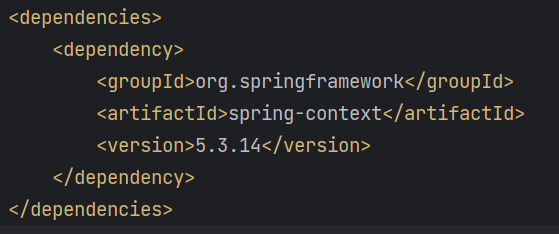
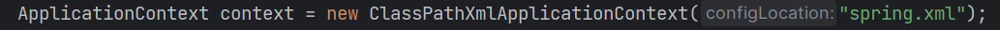
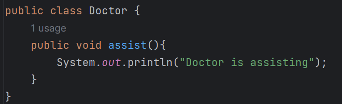
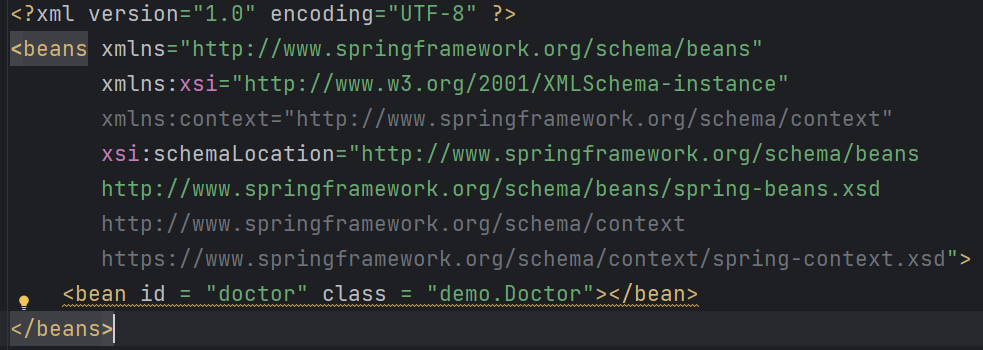
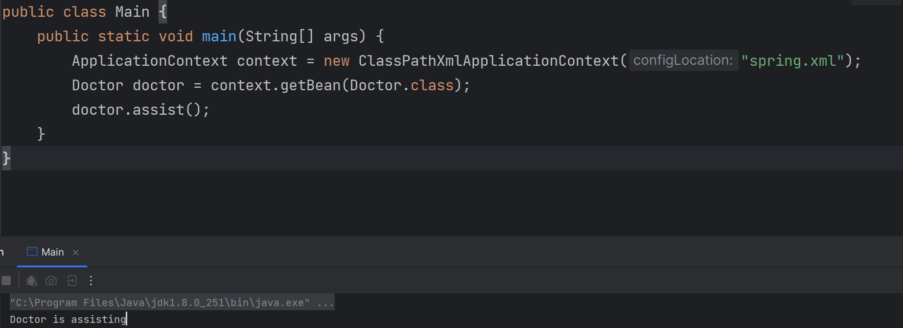

### XML Configuration
* Add dependency in pom.xml file
  
> **Spring-context dependency** –> defines the Spring Container

*Maven get all the dependencies in our local repository by fetching all the jar files which we define in pom.xml from centeral repository*
* There are two container interfaces available in spring:
1. Bean-Factory
2. Application Context
> *Application context extends bean factory*

* We create object of Application Context of class ClassPathXmlApplicationContext
> *ClassPathXmlApplicationContext can load an XML configuration from a classpath and manage its beans*

> Over Here *spring.xml* is our xml file from which we load our beans

The objects in the spring application and that are managed by the Spring container are called *beans*

---
>We have a ***Doctor class*** with a method assist
---
* *We define ***bean*** of Doctor class in spring.xml*
----
* Here we can see that without creating object of doctor class we called assist method