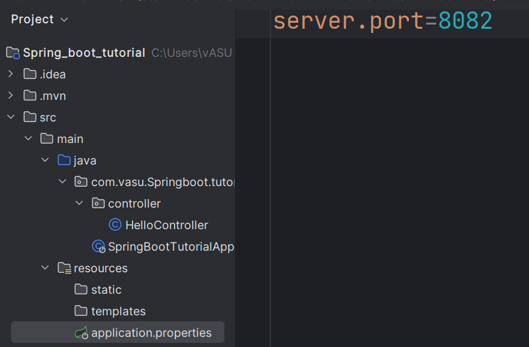
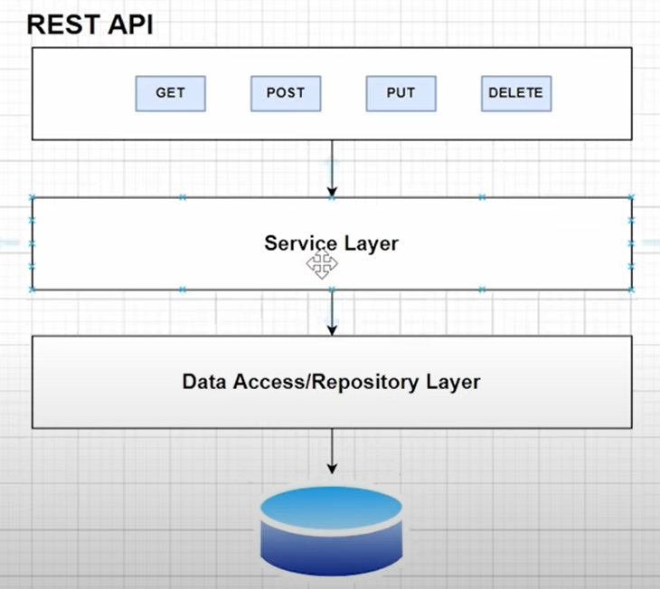

>***Spring Boot does Autoconfiguration but in case we want to change configuration we can do that as well.***



* REST API : will be our controller layer to handle our Request.
* Service layer will contain our business logic. From service layer we call our Data Access Layer.
* Data Access layer interacts with our database.

***configeration for h2 database***
````
spring.h2.console.enabled = true
spring.datasource.url = jdbc:h2:mem:dcbapp
spring.datasource.driverClassName = org.h2.Driver
spring.datasource.username = sa
spring.datasource.password = password
spring.jpa.databasePlatform = org.hibernate.dialect.H2Dialect
````
***We use error handling in service layer because that is where we get the data from***

***configeration for mysql database***
````
spring.jpa.hibernate.ddl-auto=update
spring.datasource.url=jdbc:mysql://localhost:3306/dcbapp
spring.datasource.username=root
spring.datasource.password=root
spring.datasource.driver-class-name=com.mysql.jdbc.Driver
spring.jpa.show-sql: true
````
***we can also create a application.yml file in this file we can add configuration as well***

### Why we need a yml file ?
* It is a more human readable format.
* It reduces duplicate values.